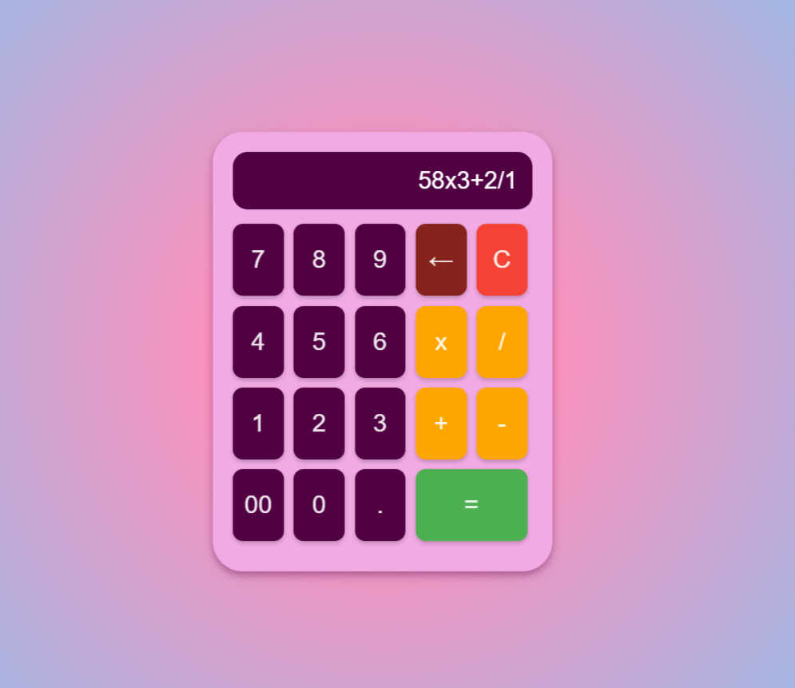

# Simple Calculator

This is a simple calculator program that performs basic arithmetic operations such as addition, subtraction, multiplication, and division.

## Features

- Contrary to basic calculators, this calculator allows up to 20 inputs for numbers and operators.
- Multiple operations can be entered and performed.
- Decimals are allowed and controlled to only be enetered once per section of numbers.
- Operators cannot be followed by operators, only numbers.
- Backspace button for deleting.
- No dividing by zero

## Preview

<p align="center">
    
</p>

## Requirements

- A browser
- No internet connection required

## Installation

1. Clone the repository:
   ```bash
   git clone https://github.com/JuanCardenas0/MyCalculatorJC
   ```
2. Navigate to the project directory:
   ```bash
   cd Calc
   ```

## Usage

1. Run html file.
2. Follow the prompts to input numbers and select operations.
3. View the result of the calculation.

## Example

Use browser interface to enter numbers.
Use buttons to select operator.
Select as many numbers and operators as needed. (Max 20 characters allowed)
Click on equal button.
Result displayed on screen.

## Contributing

Contributions are welcome! Feel free to open an issue or submit a pull request.

## License

This project is licensed under the [MIT License](LICENSE).
